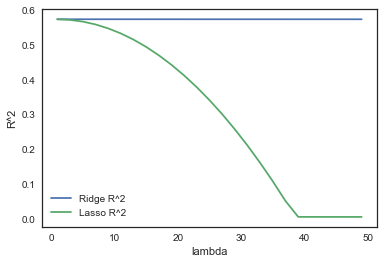

```python
import pandas as pd
from matplotlib import pyplot as plt
import numpy as np
import math
import seaborn as sns
import sklearn
from sklearn import linear_model
from sklearn import preprocessing
%matplotlib inline
sns.set_style('white')
```


```python
# Load air quality data, drop the index column and any missing data columns.
df = pd.read_csv(
    'https://vincentarelbundock.github.io/Rdatasets/csv/ISLR/Default.csv'
).iloc[:, 1:].dropna()

# Recode strings to numeric.
df['default'] = np.where(df['default'] == 'Yes', 1, 0)
df['student'] = np.where(df['student'] == 'Yes', 1, 0)
names = df.columns
df = pd.DataFrame(preprocessing.scale(df), columns=names)

# Define the training and test sizes.
trainsize = int(df.shape[0] / 2)
df_test = df.iloc[trainsize:, :].copy()
df_train = df.iloc[:trainsize, :].copy()

# Set up the regression model to predict solar radiation using all other
# variables as features.
regr1 = linear_model.LinearRegression()
Y_train = df_train['income'].values.reshape(-1, 1)
X_train = df_train.loc[:, ~(df_train.columns).isin(['income'])]
regr1.fit(X_train, Y_train)
print('\nR-squared simple model:')
print(regr1.score(X_train, Y_train))

#Store the parameter estimates.
origparams = np.append(regr1.coef_, regr1.intercept_)

# Make new features to capture potential quadratic and cubic relationships
# between solar radiation and day or temperature.
df_train['balance_student'] = df_train['balance'] * df_train['student']
df_train['balance_default'] = df_train['balance'] * df_train['default']
df_train['student_default'] = df_train['student'] * df_train['default']
df_train['balance_sqrt'] = (df_train['balance'] + 100) ** .5
df_train['balance2'] = (df_train['balance'] + 100) ** 2
df_train['balance3'] = (df_train['balance'] + 100) ** 3

# Re-run the model with the new features.
regrBig = linear_model.LinearRegression()
X_train2 = df_train.loc[:, ~(df_train.columns).isin(['income'])]
regrBig.fit(X_train2, Y_train)
print('\nR-squared complex model:')
print(regrBig.score(X_train2, Y_train))

# Store the new parameter estimates for the same features.
newparams = np.append(
    regrBig.coef_[0,0:(len(origparams)-1)],
    regrBig.intercept_)

print('\nParameter Estimates for the same predictors for the small model '
      'and large model:')
compare = np.column_stack((origparams, newparams))
prettycompare = np.array2string(
    compare,
    formatter={'float_kind':'{0:.3f}'.format})
print(prettycompare)
```

    
    R-squared simple model:
    0.573878496272
    
    R-squared complex model:
    0.573973445209
    
    Parameter Estimates for the same predictors for the small model and large model:
    [[0.014 -0.004]
     [-0.759 -0.759]
     [0.000 4157.866]
     [-0.001 553434.479]]
    


```python
# Test the simpler model with smaller coefficients.
Y_test = df_test['income'].values.reshape(-1, 1)
X_test = df_test.loc[:, ~(df_test.columns).isin(['income'])]
print('\nR-squared simple model:')
print(regr1.score(X_test, Y_test))

# Test the more complex model with larger coefficients.
df_test['balance_student'] = df_test['balance'] * df_test['student']
df_test['balance_default'] = df_test['balance'] * df_test['default']
df_test['student_default'] = df_test['student'] * df_test['default']
df_test['balance_sqrt'] = (df_test['balance'] + 100) ** .5
df_test['balance2'] = (df_test['balance'] + 100) ** 2
df_test['balance3'] = (df_test['balance'] + 100) ** 3

# Re-run the model with the new features.
X_test2 = df_test.loc[:, ~(df_test.columns).isin(['income'])]
print('\nR-squared complex model:')
print(regrBig.score(X_test2, Y_test))
```

    
    R-squared simple model:
    0.56306979225
    
    R-squared complex model:
    0.563023952733
    


```python
# Fitting a ridge regression model. Alpha is the regularization
# parameter (usually called lambda). As alpha gets larger, parameter
# shrinkage grows more pronounced. Note that by convention, the
# intercept is not regularized. Since we standardized the data
# earlier, the intercept should be equal to zero and can be dropped.

ridgeregr = linear_model.Ridge(alpha=10, fit_intercept=False) 
ridgeregr.fit(X_train, Y_train)
print(ridgeregr.score(X_train, Y_train))
origparams = ridgeregr.coef_[0]
print(origparams)

ridgeregrBig = linear_model.Ridge(alpha=10, fit_intercept=False)
ridgeregrBig.fit(X_train2, Y_train)
print(ridgeregrBig.score(X_train2, Y_train))
newparams = ridgeregrBig.coef_[0, 0:len(origparams)]

print('\nParameter Estimates for the same predictors for the small model'
      'and large model:')
compare = np.column_stack((origparams, newparams))
prettycompare = np.array2string(
    compare,
    formatter={'float_kind':'{0:.3f}'.format})
print(prettycompare)
```

    0.57387391644
    [  1.36988466e-02  -7.57859433e-01  -3.25298557e-04]
    0.573946428961
    
    Parameter Estimates for the same predictors for the small modeland large model:
    [[0.014 -0.002]
     [-0.758 -0.757]
     [-0.000 0.048]]
    


```python
# Store estimates.
estimates = []
lambda_values = []

# Storing legend information.
labels = [['R^2', 'lambda']]

#Run the model for many alphas.
for lambd in range(1, 50, 2):
    ridgeregrBig = linear_model.Ridge(alpha=lambd, fit_intercept=False)
    ridgeregrBig.fit(X_train2, Y_train)
    lambda_values.append(lambd)
    estimates.append(ridgeregrBig.score(X_train2,Y_train))

estimates_l = []
    
#Run the lasso model for many alphas.
for lambd in np.arange(0, 1, .04):
    ridgeregrBig = linear_model.Lasso(alpha=lambd, fit_intercept=False)
    ridgeregrBig.fit(X_train2, Y_train)
    estimates_l.append(ridgeregrBig.score(X_train2,Y_train))
    
# Make the data pretty.
estimates_df = pd.DataFrame()
estimates_df['Ridge R^2'] = estimates
estimates_df['Lasso R^2'] = estimates_l
estimates_df['lambda'] = lambda_values
estimates_df.sort_values(by='lambda', inplace=True, ascending=True)
estimates_df.set_index('lambda',inplace=True)


#Plot a line for each parameter.
for col in estimates_df:
    plt.plot(estimates_df.index, estimates_df[col])
labels.append(var)
plt.xlabel('lambda')
plt.ylabel('R^2')
plt.legend()
plt.show()
estimates_df
```

    c:\users\abe\appdata\local\programs\python\python36-32\lib\site-packages\ipykernel\__main__.py:20: UserWarning: With alpha=0, this algorithm does not converge well. You are advised to use the LinearRegression estimator
    c:\users\abe\appdata\local\programs\python\python36-32\lib\site-packages\sklearn\linear_model\coordinate_descent.py:470: UserWarning: Coordinate descent with alpha=0 may lead to unexpected results and is discouraged.
      positive)
    c:\users\abe\appdata\local\programs\python\python36-32\lib\site-packages\sklearn\linear_model\coordinate_descent.py:484: ConvergenceWarning: Objective did not converge. You might want to increase the number of iterations. Fitting data with very small alpha may cause precision problems.
      ConvergenceWarning)
    





<div>
<table border="1" class="dataframe">
  <thead>
    <tr style="text-align: right;">
      <th></th>
      <th>Ridge R^2</th>
      <th>Lasso R^2</th>
    </tr>
    <tr>
      <th>lambda</th>
      <th></th>
      <th></th>
    </tr>
  </thead>
  <tbody>
    <tr>
      <th>1</th>
      <td>0.573969</td>
      <td>0.573939</td>
    </tr>
    <tr>
      <th>3</th>
      <td>0.573960</td>
      <td>0.572063</td>
    </tr>
    <tr>
      <th>5</th>
      <td>0.573955</td>
      <td>0.567210</td>
    </tr>
    <tr>
      <th>7</th>
      <td>0.573951</td>
      <td>0.559127</td>
    </tr>
    <tr>
      <th>9</th>
      <td>0.573948</td>
      <td>0.547813</td>
    </tr>
    <tr>
      <th>11</th>
      <td>0.573945</td>
      <td>0.533269</td>
    </tr>
    <tr>
      <th>13</th>
      <td>0.573943</td>
      <td>0.515495</td>
    </tr>
    <tr>
      <th>15</th>
      <td>0.573940</td>
      <td>0.494490</td>
    </tr>
    <tr>
      <th>17</th>
      <td>0.573938</td>
      <td>0.470255</td>
    </tr>
    <tr>
      <th>19</th>
      <td>0.573936</td>
      <td>0.442789</td>
    </tr>
    <tr>
      <th>21</th>
      <td>0.573933</td>
      <td>0.412094</td>
    </tr>
    <tr>
      <th>23</th>
      <td>0.573931</td>
      <td>0.378167</td>
    </tr>
    <tr>
      <th>25</th>
      <td>0.573928</td>
      <td>0.341011</td>
    </tr>
    <tr>
      <th>27</th>
      <td>0.573925</td>
      <td>0.300624</td>
    </tr>
    <tr>
      <th>29</th>
      <td>0.573922</td>
      <td>0.257007</td>
    </tr>
    <tr>
      <th>31</th>
      <td>0.573919</td>
      <td>0.210159</td>
    </tr>
    <tr>
      <th>33</th>
      <td>0.573915</td>
      <td>0.160082</td>
    </tr>
    <tr>
      <th>35</th>
      <td>0.573912</td>
      <td>0.106773</td>
    </tr>
    <tr>
      <th>37</th>
      <td>0.573908</td>
      <td>0.050235</td>
    </tr>
    <tr>
      <th>39</th>
      <td>0.573904</td>
      <td>0.004700</td>
    </tr>
    <tr>
      <th>41</th>
      <td>0.573900</td>
      <td>0.004688</td>
    </tr>
    <tr>
      <th>43</th>
      <td>0.573896</td>
      <td>0.004676</td>
    </tr>
    <tr>
      <th>45</th>
      <td>0.573891</td>
      <td>0.004665</td>
    </tr>
    <tr>
      <th>47</th>
      <td>0.573886</td>
      <td>0.004653</td>
    </tr>
    <tr>
      <th>49</th>
      <td>0.573882</td>
      <td>0.004642</td>
    </tr>
  </tbody>
</table>
</div>


```python

```
